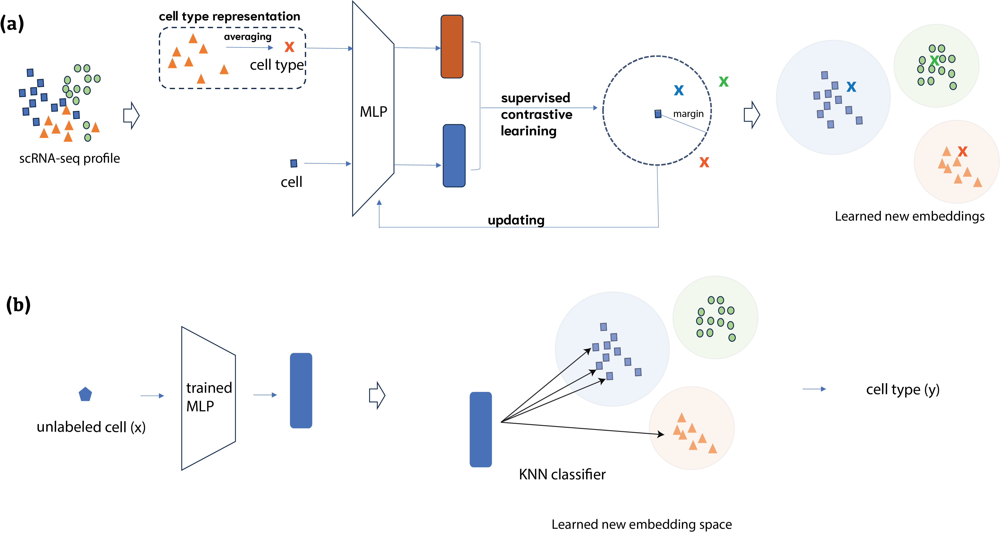

# Supervised contrastive learning for single-cell annotation

In this work, we developed a novel modeling formalism for cell type annotation with a supervised contrastive learning method, named SCLSC (Supervised Contrastive Learning for Single Cell). 
Different from the previous usage of contrastive learning in single cell data analysis, we employed the contrastive learning for instance-type pairs instead of instance-instance pairs. 
Mores specifically, in the cell type annotation task, the contrastive learning is applied to learn cell and cell type representation that render cells of the same type to be clustered in the new embedding space. 
Through this approach, the knowledge derived from annotated cells is transferred to the feature representation for scRNA-seq data. 




## Enviroments and Package dependency

- python 3
- Pytorch 1.11 
- scanpy
- anndata


## Learning cell and cell type embedding
```
ENCODER="MLP"
MARGIN=1
AVG_K=1
EPOCH=100
GENE_SET="hvg"

DATADIR=PATH_of_DATA_DIRECTORY
MODEL_SAVE_DIR=PATH_of_MODEL_SAVE_DIRECTORY
DATASET="zebrafish_all"
OUTPUTDIR=PATH_of_OUTPUT_DIRECTORY

echo "Processing $DATASET"

python sc2l_main.py --encoder $ENCODER  --dataset_name $DATASET --data_dir $DATADIR --model_dir $MODEL_SAVE_DIR \
--gene_set ${GENE_SET} --margin $MARGIN --avg_sample_portion $AVG_K --output_dir $OUTPUTDIR --epoch $EPOCH

```

## Cell type annotation and visualization

```
DATADIR=PATH_of_DATA_DIRECTORY"
MODEL_SAVE_DIR=PATH_of_MODEL_SAVE_DIRECTORY
DATASET="zebrafish_all"
OUTPUTDIR=PATH_of_OUTPUT_DIRECTORY

python sc2l_test_knn.py --encoder $ENCODER  --dataset_name $DATASET --data_dir $DATADIR --model_dir $MODEL_SAVE_DIR \
--gene_set ${GENE_SET} --margin $MARGIN --avg_sample_portion $AVG_K --output_dir $OUTPUTDIR --epoch $EPOCH 
```


